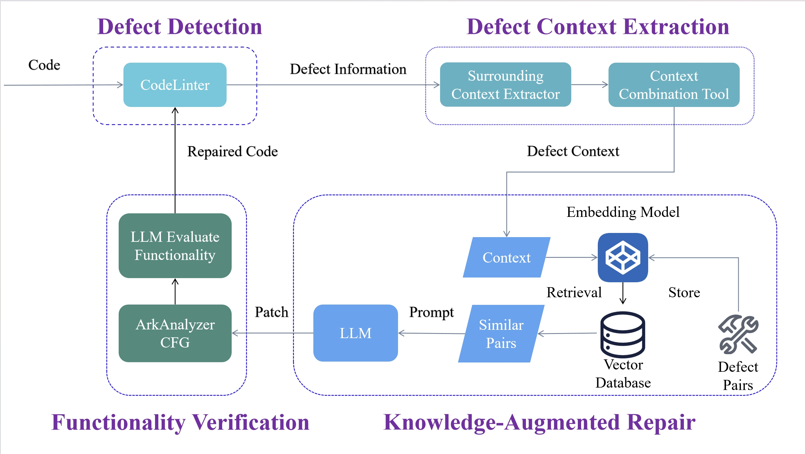
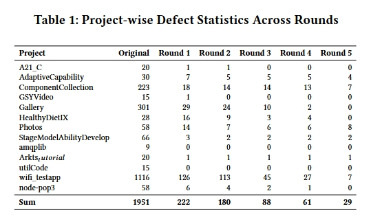

# ArkTS Code Defect Repair System

This repository is the official repository of "HapRepair: Learn to Repair OpenHarmony Apps". 

This is an automated ArkTS code defect repair system based on large language models. The system uses Retrieval-Augmented Generation (RAG) technology combined with multiple large language models to detect and fix performance defects in ArkTS code.

Here's the framework of the system:



## Key Features

- Code defect detection
- RAG-based code repair suggestion generation
- Multi-round code repair
- Code functionality verification
- Multi-model support (GPT, Deepseek, Qwen, etc.)

## System Architecture

The system consists of the following main modules:

- Code Repair Module (`fix.py`, `fix_projects.py`)
- Vector Retrieval Module (`save_defects_to_database.py`)
- Prompt Generation Module (`get_prompt.py`)
- Output Processing Module (`output_handler.py`)
- Context Extraction Module (`get_surrounding_context.py`)

## CFG

The control flow graph is generated by ArkAnalyzer.

You can get the CFG of the projects by running the script `arkanalyzer/tests/CFGTest.ts`.

## Supported Models

- OpenAI GPT Series
- Deepseek Chat
- Qwen
- Ollama
- LLaMA
- GPTGod

## Usage

1. Configure environment variables:
```
OPENAI_API_KEY=<your_key>
OPENAI_API_BASE=<api_base>
DEEPSEEK_API_KEY=<your_key>
DEEPSEEK_API_BASE=<api_base>
PINECONE_API_KEY=<your_key>
```

2. Install dependencies:
```
pip install -r requirements.txt
```

3. Run defect detection:
```
python RQ1.py
```

4. Run code repair:
```
python fix.py
```

Besides, you can use CodeLinter in [Huawei DevEco Studio](https://developer.huawei.com/consumer/cn/deveco-studio/archive/) to detect code defects.

And use [ArkAnalyzer](https://gitee.com/openharmony-sig/arkanalyzer) to obtain the CFG of the code to check the functionality of the code.

## Data Visualization

The project includes a data visualization module (`draw.ipynb`) that can generate:
- Defect detection accuracy analysis charts
- Multi-round repair effectiveness comparison charts

## Key Features

- Uses RAG to improve repair quality
- Supports multiple large language models
- Multi-round iterative repair mechanism
- Code functionality verification ensures repair quality
- Context-aware code repair

## Results:


## Important Notes

- Requires configuration of relevant API keys
- Recommended Python version: 3.10+
- Requires sufficient GPU memory for running large language models
- Recommended to backup code before repair

## Contributing

Issues and Pull Requests are welcome to help improve the project.

## License

This project is licensed under the MIT License - see the [LICENSE](LICENSE) file for details.
