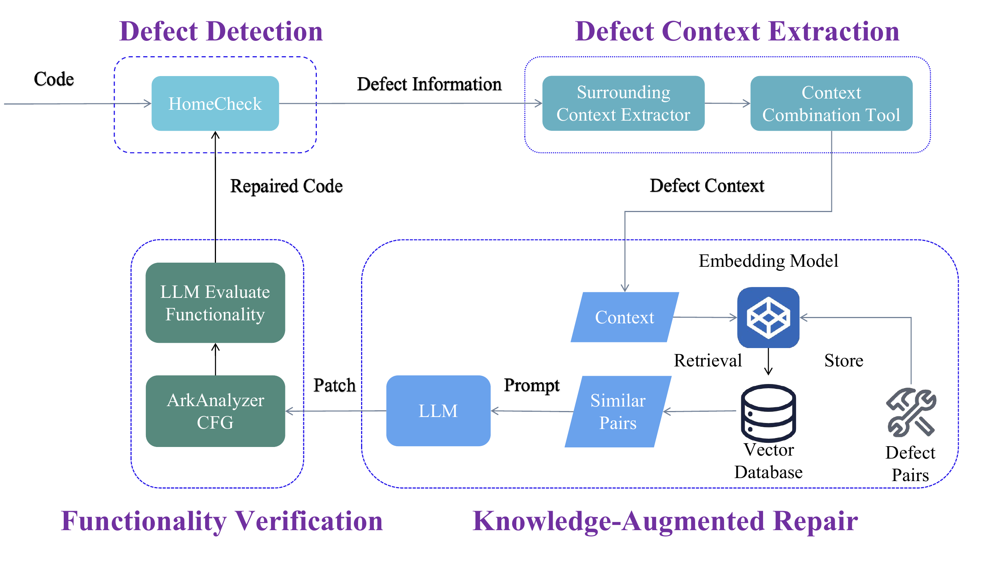
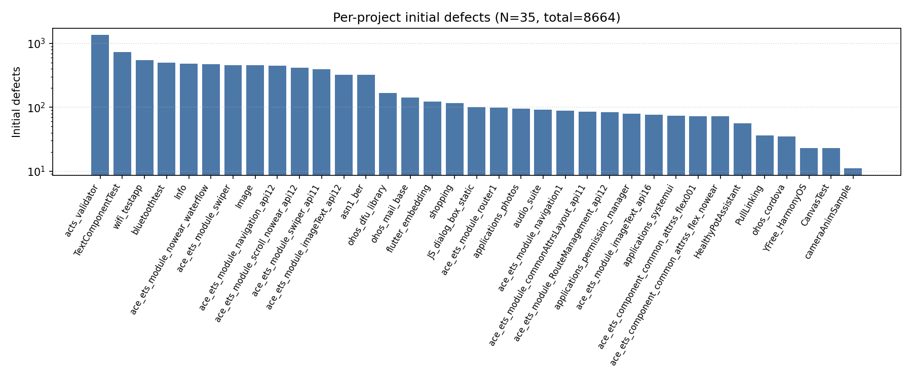
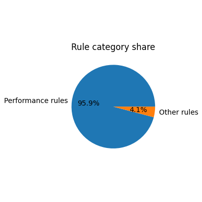
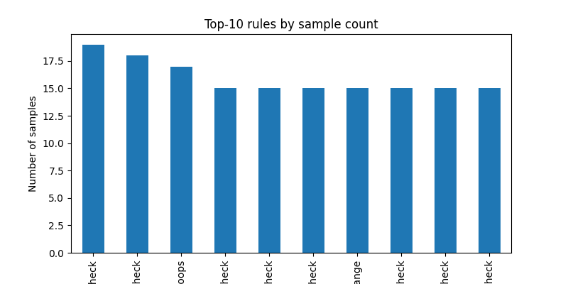
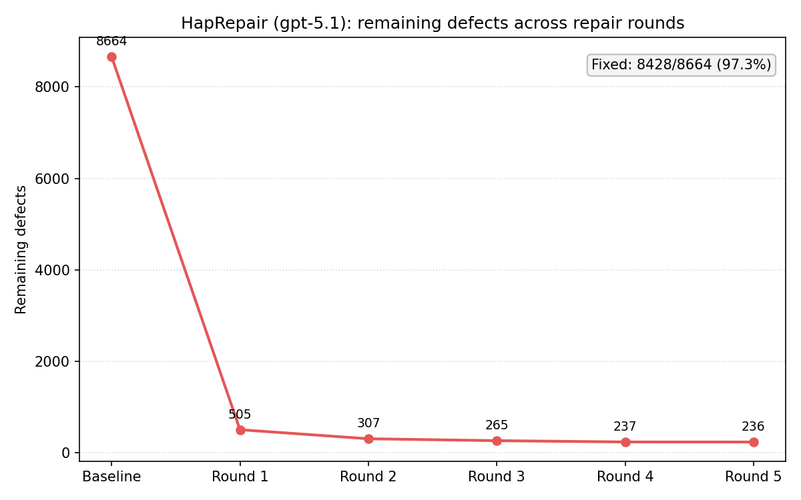

# ArkTS Code Defect Repair System

This repository is the official repository of "HapRepair: Learn to Repair OpenHarmony Apps". 

This is an automated ArkTS code defect repair system based on large language models. The system uses Retrieval-Augmented Generation (RAG) technology combined with multiple large language models to detect and fix performance defects in ArkTS code.

Here's the framework of the system:



## Key Features

- Code defect detection
- RAG-based code repair suggestion generation
- Multi-round code repair
- Code functionality verification
- Multi-model support (GPT, Deepseek, Qwen, etc.)

## System Architecture

The system consists of the following main modules:

- Code Repair Module (`fix.py`, `fix_projects.py`)
- Vector Retrieval Module (`save_defects_to_database.py`)
- Prompt Generation Module (`get_prompt.py`)
- Output Processing Module (`output_handler.py`)
- Context Extraction Module (`get_surrounding_context.py`)

## CFG

The control flow graph is generated by ArkAnalyzer.

You can get the CFG of the projects by running the script `arkanalyzer/tests/CFGTest.ts`.

## Supported Models

- OpenAI GPT Series
- Deepseek Chat
- Qwen
- Ollama
- LLaMA
- GPTGod

## Usage

1. Configure environment variables:
```
OPENAI_API_KEY=<your_key>
OPENAI_API_BASE=<api_base>
DEEPSEEK_API_KEY=<your_key>
DEEPSEEK_API_BASE=<api_base>
PINECONE_API_KEY=<your_key>
```

2. Install dependencies:
```
pip install -r requirements.txt
```

3. Run defect detection:
```
python RQ1.py
```

4. Run code repair:
```
python fix.py
```

Besides, you can use CodeLinter in [Huawei DevEco Studio](https://developer.huawei.com/consumer/cn/deveco-studio/archive/) to detect code defects.

And use [ArkAnalyzer](https://gitee.com/openharmony-sig/arkanalyzer) to obtain the CFG of the code to check the functionality of the code.

## Experimental Setup

We evaluate HapRepair on a curated benchmark of real-world OpenHarmony apps:

- **Benchmark**: 8,664 performance/security defects across 100+ OpenHarmony projects, reported by Huawei CodeLinter and tracked in `revision/target_projects_haprepair.json`.
- **Rule taxonomy**: 37 performance rules triggered across the benchmark; 15 (40.5%) are context-dependent and 22 (59.5%) are local/template-sufficient (see `summary/gpt-5.1_rq2_rule_type_context_ratio.md`).
- **Pipeline**: (1) CodeLinter scans each project, (2) `get_surrounding_context.py` extracts the surrounding context for every finding, (3) `save_defects_to_database.py` indexes curated fix exemplars into a Pinecone vector store, (4) `get_prompt.py` retrieves the top-k nearest exemplars via RAG and assembles a repair prompt, and (5) `fix.py` / `fix_projects.py` drive an iterative multi-round repair loop with `output_handler.py` validating each patch.
- **Models evaluated**: gpt-5.1 (main), gpt-5-mini, deepseek-chat, qwen3-coder-plus, qwen3-30b-a3b.
- **Ablation axes**: RAG top-k ∈ {0, 1, 3, 5}, diff strategy ∈ {difflib, gpt-diff, no-diff}, context scope ∈ {surrounding, full-file}.
- **Protocol**: Up to 6 repair rounds per project; a defect is counted as fixed only when CodeLinter no longer reports it on the rewritten code.

Reproduce the main table with:
```
python3 revision/code/delta_check_summarize.py --allow-missing-final-logs
```

## Results



**Main result (gpt-5.1, 5 rounds).** HapRepair eliminates **8,428 / 8,664 (97.3%)** of the reported defects. After applying a conservative *delta-check* that filters any "resolved" finding plausibly attributable to large-scale code deletion, the net fix rate is still **96.11% (8,327/8,664)** — confirming that the gains come from genuine repairs rather than code removal (see `summary/gpt-5.1_delta_check.md`).

**Rule category coverage.**




**Ablation study (round-1 remaining defects, lower is better).**

| Setting                       | Remaining defects |
| ----------------------------- | ----------------- |
| RAG top-1 (default)           | 505               |
| RAG top-3                     | **444**           |
| RAG top-5                     | 1,118             |
| No RAG                        | 5,052             |
| Diff = gpt-diff               | 476               |
| Diff = none                   | 1,932             |
| Context = full file           | 2,870             |
| Context = surrounding (default) | **505**         |

Key takeaways: RAG is the dominant factor (no-RAG inflates remaining defects by **10×**); top-3 retrieval slightly beats top-1, while top-5 introduces noise; surrounding-context significantly outperforms full-file context; and supplying a structural diff matters. Full breakdown: `summary/ablation/ablation_summary_gpt-5.1_round1.md`.


## Important Notes

- Requires configuration of relevant API keys
- Recommended Python version: 3.10+
- Requires sufficient GPU memory for running large language models
- Recommended to backup code before repair

## Contributing

Issues and Pull Requests are welcome to help improve the project.

## License

This project is licensed under the MIT License - see the [LICENSE](LICENSE) file for details.
